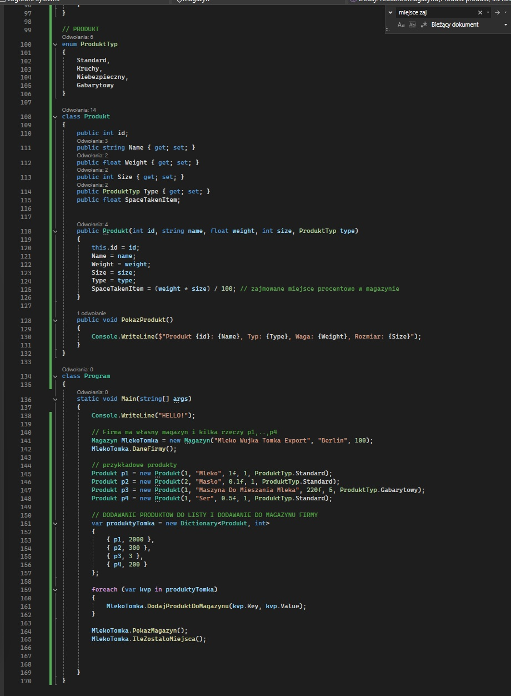
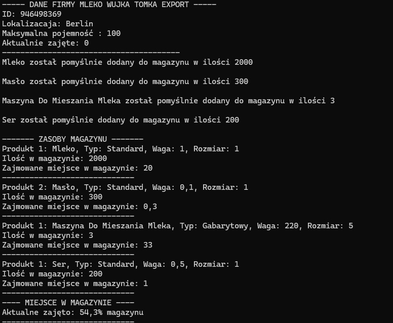

<h1 align="center">📦 System Magazynowy – aplikacja konsolowa (C#)</h1>

  Projekt edukacyjny w języku <b>C# (.NET)</b> 
  Nauka <b>programowania obiektowego (OOP)</b> oraz modelowania realnego problemu

<h2>📌 Opis projektu</h2>

Projekt przedstawia prosty <b>system magazynowy</b> działający w aplikacji konsolowej.
Jego celem jest symulacja działania magazynu, który:

<ul>
  <li>przechowuje produkty</li>
  <li>kontroluje zajętość magazynu</li>
  <li>obsługuje ograniczenia pojemności</li>
  <li>prezentuje aktualny stan w konsoli</li>
</ul>

Projekt został stworzony jako <b>forma nauki OOP</b> oraz ćwiczenie praktyczne
do egzaminu <b>INF.04</b>.

---

<h2>🎯 Dlaczego ten projekt?</h2>

Zamiast prostych przykładów oderwanych od rzeczywistości, projekt:

<ul>
  <li>odwzorowuje <b>realny problem logistyczny</b></li>
  <li>pokazuje myślenie obiektowege</li>
  <li>pokazuje, jak dane i logika współpracują ze sobą</li>
  <li>jest dobrą bazą do dalszej rozbudowy</li>
</ul>

---

<h2>🧱 Struktura projektu</h2>

<h3>📦 Klasa <code>Produkt</code></h3>

Klasa <code>Produkt</code> reprezentuje pojedynczy produkt znajdujący się w magazynie.
Przechowuje podstawowe informacje potrzebne do logistyki.

<ul>
  <li>identyfikator produktu</li>
  <li>nazwę</li>
  <li>wagę</li>
  <li>rozmiar</li>
  <li>typ produktu (enum)</li>
</ul>

Na podstawie wagi i rozmiaru obliczana jest wartość:
<b>SpaceTakenItem</b> – czyli ile miejsca zajmuje jedna sztuka produktu w magazynie.

Przykładowa implementacja klasy <code>Produkt</code>:

  

---

<h3>🏭 Klasa <code>Magazyn</code></h3>

Klasa <code>Magazyn</code> reprezentuje magazyn firmy.
Odpowiada za:

<ul>
  <li>przechowywanie produktów</li>
  <li>kontrolę zajętości magazynu</li>
  <li>sprawdzanie limitów</li>
  <li>prezentację danych w konsoli</li>
</ul>

Magazyn posiada:

<ul>
  <li>unikalne ID</li>
  <li>nazwę</li>
  <li>lokalizację</li>
  <li>limit pojemności</li>
  <li>aktualnie zajęte miejsce</li>
  <li>słownik produktów i ich ilości</li>
</ul>

---

<h2>🔁 Komunikacja między klasami (prosto)</h2>

Relacje w projekcie są celowo proste:

<ul>
  <li><b>Produkt</b> – przechowuje dane o produkcie</li>
  <li><b>Magazyn</b> – posiada produkty i zarządza nimi</li>
</ul>

Magazyn:

<ul>
  <li>przyjmuje obiekty typu <code>Produkt</code></li>
  <li>sprawdza, czy jest wystarczająco dużo miejsca</li>
  <li>dodaje produkt do swojego stanu</li>
  <li>wyświetla aktualny stan w konsoli</li>
</ul>

Dzięki temu:

<ul>
  <li>każda klasa ma jasną odpowiedzialność</li>
  <li>kod jest czytelny i łatwy do rozbudowy</li>
</ul>

---

<h2>▶️ Przykładowe działanie aplikacji</h2>

Po uruchomieniu programu:

<ul>
  <li>tworzony jest magazyn</li>
  <li>tworzone są przykładowe produkty</li>
  <li>produkty są dodawane do magazynu</li>
  <li>w konsoli wyświetlany jest aktualny stan</li>
</ul>

  

---

<h2>🚀 Planowana rozbudowa</h2>

Projekt jest bazą pod większą aplikację konsolową.
W kolejnych etapach planowane jest dodanie:

<ul>
  <li>📦 klasy <b>Paczka</b> (produkty + ilości)</li>
  <li>🚚 Dodajnie wysyłania produtków do sklepów</li>
  <li>💵 Szacowany zarobek za produkty</li>
  <li>📊 zmniejszenei szans na zarobek poprzez zdarzenia losowe oraz typy np. niebezpieczny </li>
  <li>🌍 usuwanie produtków i przenoszenie między magazynami</li>
  <li>⚠️ Funkcjonalność typów: (gabaryty, produkty niebezpieczne)</li>
  <li>📜 menu konsolowego (dodawanie, usuwanie, podgląd)</li>
  <li></li>
</ul>

Celem jest stworzenie <b>w pełni działającej aplikacji konsolowej</b>,
która w logiczny sposób symuluje działanie systemu logistycznego.

---

<h2>🧑‍💻 Podsumowanie</h2>

Projekt:

<ul>
  <li>jest ćwiczeniem OOP w C#</li>
  <li>odzwierciedla realny problem</li>
  <li>jest czytelny i możliwy do dalszej rozbudowy</li>
  <li>dobrze wpisuje się w zakres egzaminu <b>INF.04</b></li>
</ul>
